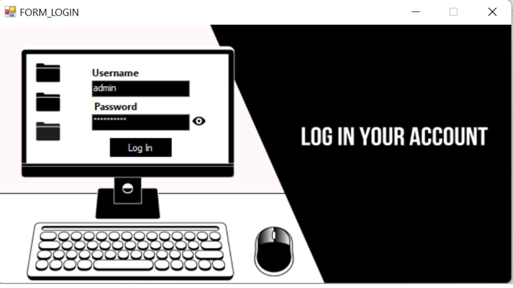
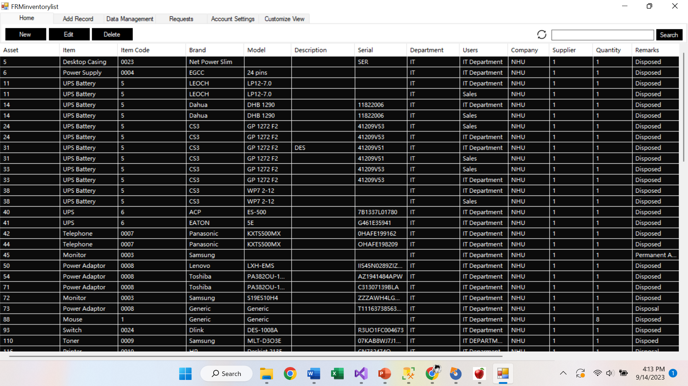
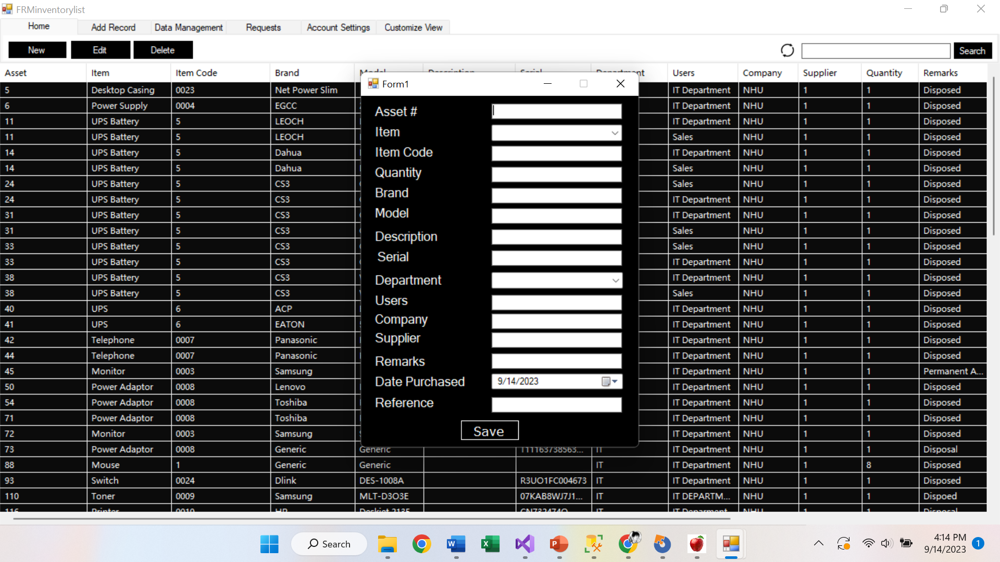
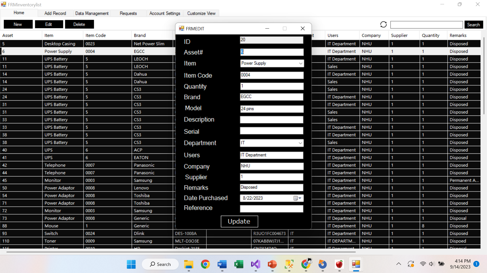
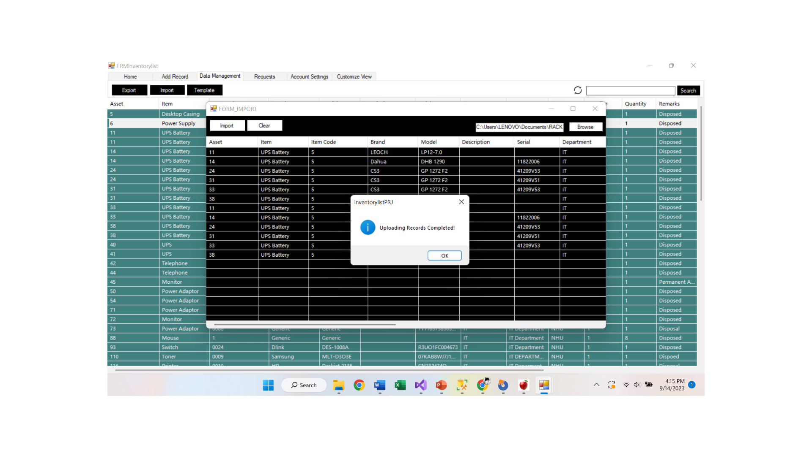
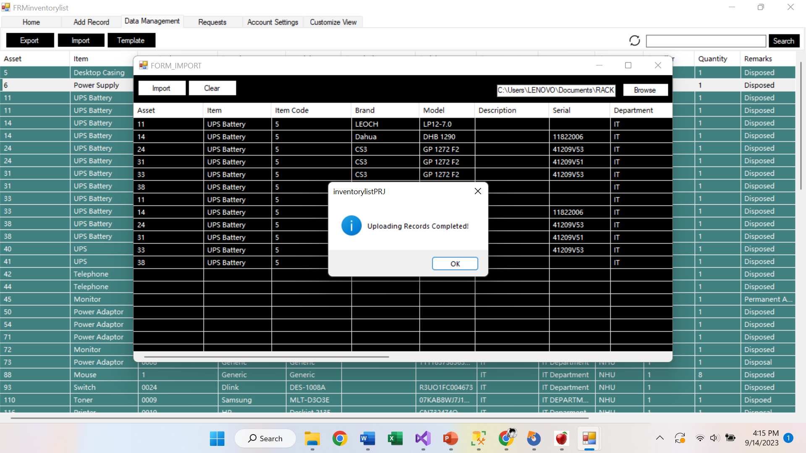
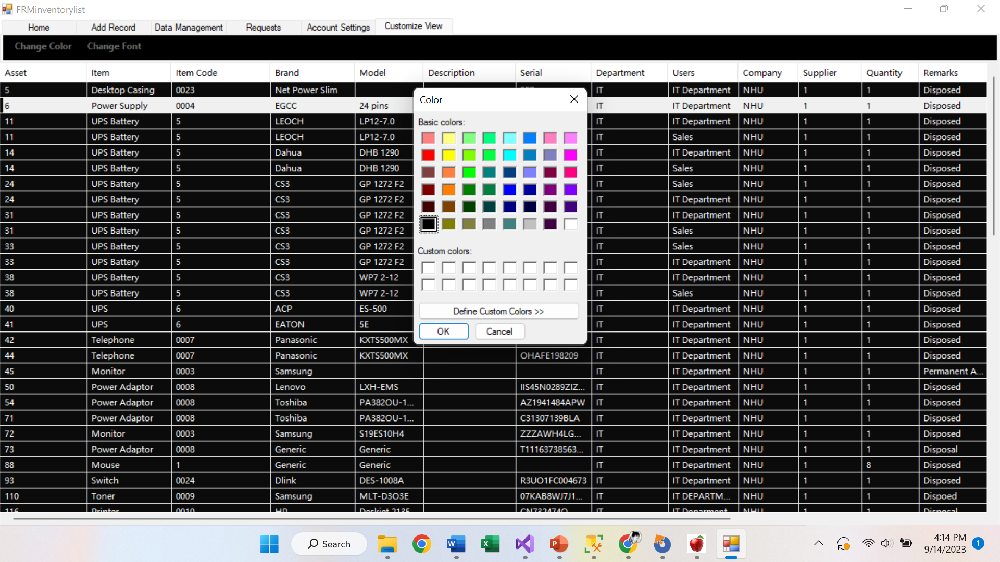

# Internship
#  IT Department Inventory Monitoring System

This project is designed to help monitor all items that are **sent, borrowed, or officially assigned** within an organization’s IT department. It serves as a digital logbook—tracking **what item was moved, who received it, when it was dispatched, and when it was returned**.

Whether an asset is going **in** or **out**, this system ensures transparency, accountability, and smooth internal operations.

##  Tech Stack

---

##  Screenshots Only (For Privacy)

 **Important Notice:**  
To protect **company privacy, internal data, and sensitive information**, this repository will only contain **screenshots** of the system’s UI and workflow.  
No real data, internal documents, or company-specific configurations will be uploaded.

---

##  System Screenshots

### 📌 Screenshot 1

### 📌 Screenshot 2

### 📌 Screenshot 3

### 📌 Screenshot 4

### 📌 Screenshot 5

### 📌 Screenshot 6

### 📌 Screenshot 7

---
